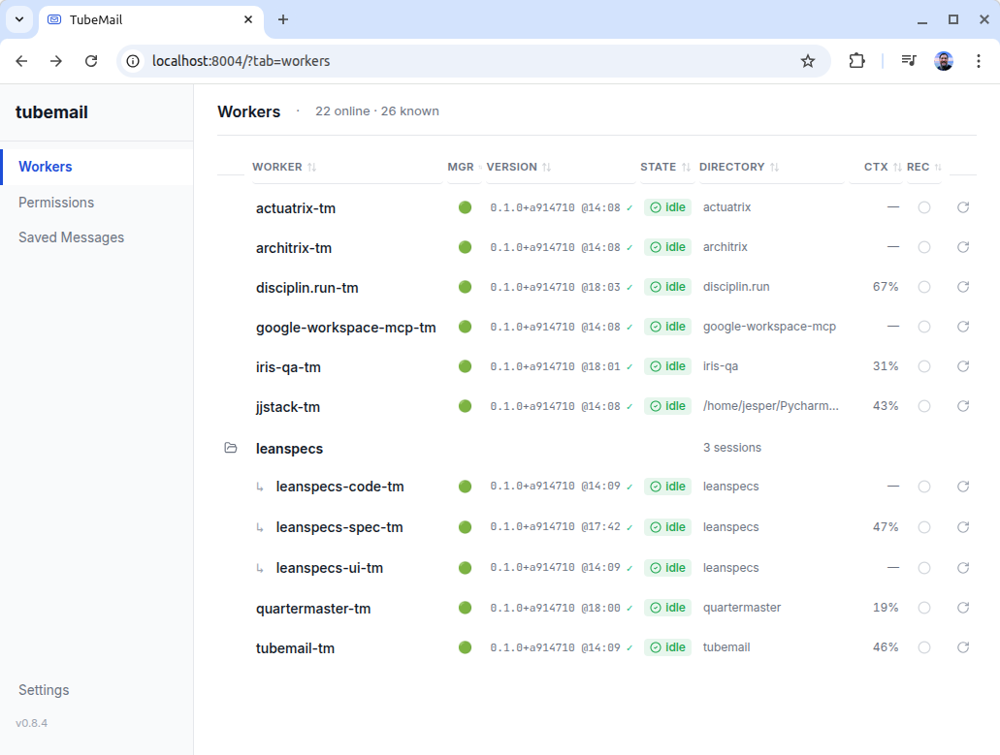

# TubeMail for Claude Code

Claude Code workers on a wire.

TubeMail lets one Claude Code session drive another. Start a worker in
any directory, and any other Claude Code session (or MCP-aware agent)
can send it messages, receive replies, approve permission prompts
remotely, restart it, and watch what it's doing — all over HTTP/SSE +
WebSocket.

## What this is

- A **hub** service (FastAPI + FastMCP) that brokers events between
  workers and exposes a web UI on the same port.
- A **channel** (Claude Code plugin) that relays events between a
  worker's `claude` session and the hub.
- A **process manager** (`tubemail.manager`) that runs `claude` in a
  pty, handles restarts, idle detection, and harness commands
  (`/compact`, `/clear`, `/exit`, `/mcp` reconnects).
- A **bash wrapper** (`claude-tm`) that sources env vars and keeps the
  manager alive across restarts.
- A **web UI** (React + Vite) served alongside `/mcp` on the same port,
  with a live worker roster, a permission inbox, integrated browser
  terminals via WebSocket pty bridge, saved-message templates, and
  optional per-worker session recording.

## What this is not

- Not an orchestrator. TubeMail ships transport plus an operator
  surface; it does NOT implement orchestration policy (failure routing,
  retry, scheduling, load balancing). Build that on top.
- Not a replacement for Claude Code's native tools. Workers are vanilla
  `claude` processes.

## Architecture

```
                                                  ┌──────────────────┐
       browser ◀──── HTTPS + WSS pty bridge ─────▶│  TubeMail hub    │
                                                  │  FastMCP :8004   │
                                                  │  + web UI at /   │
       Orchestrator ◀── HTTP/SSE (MCP /mcp/) ────▶│                  │
       (any MCP client)                           └────────┬─────────┘
                                                           │
                                                           │  HTTP/SSE
                                                           ▼
                                              ┌─────────────────────────────┐
                                              │  Worker session             │
                                              │  claude-tm (bash wrapper)   │
                                              │  └─ tubemail.manager (pty)  │
                                              │     ├─ tubemail-channel     │
                                              │     └─ claude --name ...    │
                                              └─────────────────────────────┘
```

One container, one port, three protocols: HTTP/HTTPS for the JSON API
and MCP, SSE for forwarder event streams, WebSocket for the browser
terminal pty bridge.

## Install

Two packages — one for each side.

| Side | Install | Binary / tools |
|------|---------|----------------|
| Worker | `pip install tubemail` | `claude-tm` (Python launcher → `tubemail.manager` → `claude`) |
| Hub | `pip install tubemail-hub` | MCP server at `:8004`; `tm_*` tools; web UI |

For local development:

```bash
git clone git@github.com:Disciplin-run-org/tubemail.git
cd tubemail
pip install -e channel/ --no-build-isolation
pip install -e .[dev] --no-build-isolation
npm --prefix frontend ci
npm --prefix frontend run build
```

### Dev mode — live reload

The hub container runs `uvicorn --reload` with the host `src/`
bind-mounted read-only over the image's editable-install path. Edits to
`src/tubemail_hub/` on the host auto-restart the server inside the
container — no rebuild needed for Python changes.

```bash
docker compose up --build tubemail-hub   # first run — builds the image
# from here on:
# edit src/tubemail_hub/…   → uvicorn reloads automatically
# edit frontend/src/…  →  npm --prefix frontend run build to ship the bundle
docker compose restart tubemail-hub      # only needed for entrypoint / compose changes
```

`VERSION` and `frontend/dist` are mounted the same way, so a bump or a
rebuild on the host is live without a container rebuild.

## Quickstart

1. **Start the hub:**
   ```bash
   echo 'TUBEMAIL_SECRET=change-me' > .env
   docker compose up -d tubemail-hub
   ```

2. **Open the web UI** at <http://localhost:8004>. On localhost the
   bearer is auto-loaded; remote browsers paste the `TUBEMAIL_SECRET`
   value into the auth gate. The Workers tab shows the (initially empty)
   roster.

3. **Start a worker** in any project directory:
   ```bash
   pip install tubemail
   cd /path/to/your/project && claude-tm
   ```
   `pip install tubemail` puts `claude-tm` on your PATH. Export
   `TUBEMAIL_SECRET` in your shell, or drop a `.env` containing it in
   the project directory (or at `~/.config/tubemail/.env`) — `claude-tm`
   auto-loads it. The worker registers as `<dirname>-tm` and appears in
   the roster. Use `--role <name>` to run multiple workers per project.

4. **From an orchestrator session** (with the `tubemail` MCP server
   added to `.mcp.json`):
   ```python
   tm_list_workers()
   tm_send(worker="your-project-tm", message="what's in this repo?")
   tm_wait_for_activity(worker="your-project-tm", since=<event_id>)
   tm_receive(worker="your-project-tm", since=<event_id>)
   ```

A step-by-step walkthrough lives in [`TUTORIAL.md`](TUTORIAL.md).

## Web UI

<p align="center">
  
</p>

*The Workers tab. Color-coded status badges, manager indicator,
context-%, recording toggle, integrated terminals — one view of every
session.*

Served on the same port as the MCP server.

- **Workers tab** — live roster of every connected session, grouped by
  project. State badges (`idle` / `busy · 47s` / `waiting_permission` /
  `offline` / `exited`), manager-up indicator, version stamp, context-%
  column, recording toggle, sortable columns. Click a row to open the
  integrated terminal pane.
- **Permissions tab** — every pending tool-approval prompt across every
  worker, in one inbox. Keyboard allow/deny, group-by-worker, bulk
  allow-by-tool-name (one-shot).
- **Saved Messages tab** — named templates that can be sent to any
  worker by the operator (UI) or the orchestrator (MCP). Run logs are
  persisted on the hub.
- **Settings tab** — recording defaults (global on/off, max file size,
  files kept per worker), session bearer management.
- **Integrated terminal pane** — full xterm.js with a WebSocket pty
  bridge. Shift+Enter inserts a hard newline that Claude reads as
  "modifier held, do not submit." Ctrl+C copies a selection if one
  exists, otherwise SIGINT. Ctrl+V pastes. Ctrl+= / Ctrl+- / Ctrl+0
  zoom (per-worker, persisted in localStorage). Pop-out windows tile
  multiple workers across the desktop.

## Recording

Optional per-worker session recording, off by default. When enabled,
the hub tees the worker's pty output to two parallel files:

- `<data>/recordings/<worker>/<ts>.cast` — asciinema v2 format. Replay
  with `asciinema play <file>`.
- `<data>/recordings/<worker>/<ts>.frames.jsonl` — one ANSI-stripped
  text frame per pty chunk; what `tm_get_recording` returns. Optimized
  for grep and time slicing.

Files rotate when the active `.cast` exceeds the configured size limit;
the oldest are GC'd so total per-worker bytes stays under
`max_bytes_per_file * keep_files`.

Toggle from the Workers tab (per-worker `Rec` column) or via MCP:

```python
tm_recording_toggle(worker="iris-qa-tm", enabled=True)
tm_recording_status(worker="iris-qa-tm")
tm_get_recording(worker="iris-qa-tm", grep="permission", limit=50)
```

Global defaults live in the Settings tab and persist across hub
restarts under `<data>/hub-config.json`.

## Tool surface (hub MCP)

| Tool | What |
|------|------|
| **State + flow** | |
| `tm_list_workers` | Who is connected (color-coded table, project-grouped) |
| `tm_status` | `idle` / `busy` / `waiting_permission` for one worker. Trailing-inbound older than 10 min decays to `idle`. |
| `tm_send` | Deliver a message to a worker (or harness command to its manager) |
| `tm_receive` | Read a worker's event timeline |
| `tm_wait_for_activity` | Block until the worker produces an event |
| `tm_my_inbox` | Worker-facing: what messages arrived while I was offline |
| `tm_interrupt` | Pause a worker |
| `tm_clear_and_send` | Atomic: `/clear` then send, avoids race on permission prompt |
| **Permissions** | |
| `tm_pending_permissions` | List tool-approval prompts across workers |
| `tm_respond_permission` | Allow / deny a pending permission |
| **Process control** | |
| `tm_restart` | Clean restart via `/exit` + `--continue` |
| `tm_stop` | Kill a worker |
| `tm_purge_worker` | Remove a worker's registry entry |
| `tm_keystroke` | Send raw keystrokes to a worker's pty |
| `tm_screenshot` | Read recent stdout from a worker |
| `tm_health` | CPU / memory / uptime — is the worker actually working? |
| `tm_update_manager` | Re-exec the manager process to pick up new channel code |
| `tm_reconnect_mcp` | Drive the worker's `/mcp` UI to reconnect a failed server |
| **Recording** | |
| `tm_recording_toggle` | Per-worker recording on/off |
| `tm_recording_status` | Files on disk, active file, size |
| `tm_get_recording` | Read frames filtered by time range and regex |
| **Saved messages / flows** | |
| `tm_save_flow` / `tm_list_flows` / `tm_delete_flow` | CRUD for named templates |
| `tm_run_flow` | Send a saved flow to a worker, returns a `run_id` |
| `tm_get_run_log` / `tm_finish_run` | Track flow runs |
| **Meta** | |
| `get_instructions` | Re-read the server's usage notes |
| `refresh_tools` | Pick up new tools after a hub rebuild |

## Environment

| Var | Required | Purpose |
|-----|----------|---------|
| `TUBEMAIL_SECRET` | yes | Shared bearer secret between hub, channel, and browser |
| `TUBEMAIL_HUB_URL` | no (default `http://localhost:8004`) | Where channels connect |
| `TM_WORKER_NAME` | no | Override the auto-derived worker name |
| `TUBEMAIL_LOG` | no (default `WARNING`) | Channel log level |
| `TUBEMAIL_LOG_FILE` | no | Path to channel log file |
| `TUBEMAIL_DATA_DIR` | no (default `/data/tubemail`) | Hub state + recordings root |
| `TUBEMAIL_DISABLE_DEV_BOOTSTRAP` | no | If `1`, the web UI never auto-loads the bearer over loopback |
| `TUBEMAIL_WORKER_PURGE_MAX_AGE_S` | no (default `3600`) | Stale-worker purge threshold |

## Security

- **Bearer auth** on every hub endpoint (`TUBEMAIL_SECRET`). Constant-time
  compare via `hmac.compare_digest` — no timing side-channel on the secret.
- **Single-use, 30s WebSocket tickets** for the pty bridge. Browsers can't
  set custom headers on `new WebSocket()`, so the client POSTs a
  bearer-authed request to `/api/pty-ticket`, gets a single-use ticket,
  and opens `wss:/ws/pty/<worker>?ticket=<t>`. The ticket is consumed on
  use and expires in 30s.
- **Worker-name validation** (`^[A-Za-z0-9][A-Za-z0-9 _.-]{0,63}$`) on
  every `{worker}` path parameter and in the engine, so a crafted name
  cannot escape the state directory. Files in the workers directory
  whose stem does not match the pattern are ignored on startup.
- **HTTPS auto-detect** — drop `server.crt` + `server.key` into the data
  volume and the hub serves TLS. Without them it falls back to plain
  HTTP for localhost development.
- Generate a strong `TUBEMAIL_SECRET`:
  ```bash
  python -c 'import secrets; print(secrets.token_urlsafe(32))'
  ```
  `scripts/heal.py` does this for you if `.env` is missing.

Findings from the most recent security review are kept at
`jjstack/security-review.md`.

## Planning and design docs

The `jjstack/` directory holds design artifacts from planning sessions
(office-hours, CEO review, engineering review, DX review, design
review, investigations). They are checked into the repo so the decisions
that shaped the code are traceable.

The current as-built design doc is
[`jjstack/jesper-main-design-20260425-092030.md`](jjstack/jesper-main-design-20260425-092030.md);
its 2026-04-23 predecessor is preserved as superseded for history. The
four review docs (CEO, eng, DX, design) live in `jjstack/ceo-plans/`.

## License

MIT — see `LICENSE`.
